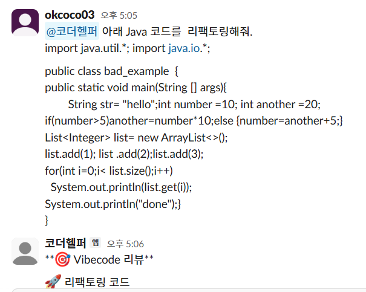
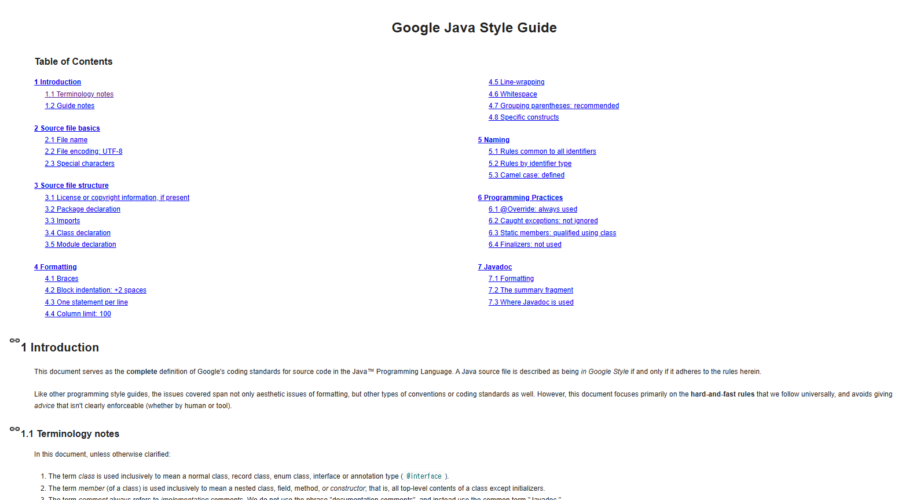
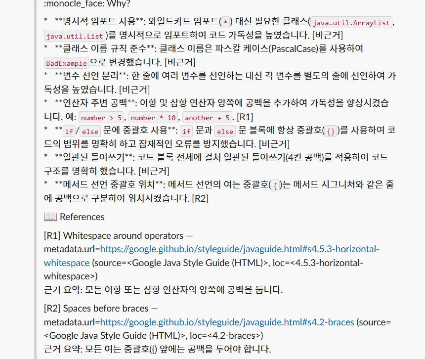

# 🎯 Vibecode: RAG 기반 Java 리팩토링 자동화 봇

> 💬 **"바이브 코딩의 속도에 실무 개발자의 견고함을 더하다"**
>
> ✨ AI 코딩 도구가 놓치기 쉬운 컨벤션, 예외 처리, 유지보수성을 **n8n 기반 RAG 파이프라인**으로 자동 검수합니다.

---
## 👨‍👨‍👦‍👦 팀원 소개
|  |  |  |
| :---: | :---: | :---: |
| [서지혜](https://github.com/seajihey) | [김종연](https://github.com/jongyeon0214) | [강민영](https://github.com/minykang) |

---

## 📌 프로젝트 개요
Vibecode는 n8n을 오케스트레이터로 활용하여 Slack 멘션 한 번으로 최신 Java 스타일 가이드(Google, Naver 등)를 실시간 참조(RAG)하고 단순 동작을 넘어선 엔지니어링 수준의 리팩토링 제안을 제공합니다.

---

## 🎖️ 주요 기능

* **RAG 기반 코드 검수**
    * **공신력 있는 근거**: Google 및 NAVER Java 스타일 가이드를 실시간 수집 및 정제하여 분석에 활용합니다.
    * **지능형 데이터 적재**: Gemini-004 임베딩과 Pinecone 벡터 DB를 통해 단순 생성이 아닌 규정 준수 여부를 판단합니다.

* **근거 기반 리팩토링**
    * **신뢰할 수 있는 답변**: 모든 수정 제안에 [R1], [R2]와 같은 **Evidence ID**를 매핑하여 출처를 명확히 제시합니다.
    

* **노드 성능 최적화** 💡
    * **비용 및 지연 절감**: JavaScript Code 노드로 다수의 인덱싱 신호를 단일 신호로 축약하여 LLM 중복 호출을 차단합니다.
    * **안정적 오케스트레이션**: 데이터 적재가 완료된 시점에만 에이전트가 실행되도록 설계하여 워크플로우의 안정성을 확보했습니다.

* **대화형 UI**
    * **스마트 트리거**: 슬랙 봇 멘션 시에만 즉각 반응하며, 분석 결과를 답장으로 제공해 가독성을 유지합니다.
    * **워크플로우 통합**: n8n을 중심으로 수집-인덱싱-추론-응답 전 과정을 자동화 파이프라인으로 구축했습니다.
---

## 🧰 기술 스택

| 분류 | 기술 |
| :--- | :--- |
| **Orchestration** | **n8n** (Workflow Automation) |
| **LLM / Embedding** | **Google Gemini 2.5 Flash**, Gemini Text-Embedding-004 |
| **Vector DB** | **Pinecone** (Serverless, Cosine Similarity) |
| **Communication** | **Slack API** (Trigger & Response) |
| **Connectivity** | **ngrok** (로컬-클라우드 협업 터널링) |

---

## 🎯 프로젝트 목표

**"AI의 생산성에 시니어 엔지니어의 전문성을 결합한 자동화 파이프라인 구축"**

* **🔗 n8n 기반의 End-to-End Workflow**
    * [수집 → 정제 → 인덱싱(RAG) → 검색 → 응답] 전 과정을 n8n 노드로 직접 설계하여 실무형 자동화 파이프라인 구축 역량을 확보합니다.

* **📚 공신력 있는 근거 중심의 리팩토링**
    * Google Style Guide, NAVER Hackday 등 권위 있는 문서 데이터를 실시간 참조하여, 리팩토링 제안에 대한 객관적인 근거와 설득력을 제공합니다.
---

## ⚙️ 시스템 아키텍쳐

---

## n8n 워크플로우

<video src="n8nPlayer.mp4" width="100%" autoplay loop muted playsinline></video>
<i>▲ 워크플로우 실행 과정</i>

## 🚀 Workflow Steps

**1️⃣ Slack Trigger**: 슬랙 @멘션을 수신하여 리팩토링 워크플로우를 시작합니다. 

 

**2️⃣ HTTP Request**: 구글·네이버의 최신 자바 스타일 가이드 원문을 실시간 수집합니다.

<table align="center">
  <tr>
    <td align="center"><b>네이버 자바 스타일 가이드</b></td>
    <td align="center"><b>구글 스타일 가이드 (Raw)</b></td>
    <td align="center"><b>구글 자바 스타일 가이드</b></td>
  </tr>
  <tr>
    <td>
      
    </td>
    <td>
      
    </td>
    <td>
      
    </td>
  </tr>
</table>

 

**3️⃣ HTML Extract**: 수집된 HTML 문서에서 노이즈를 제거하고 본문 텍스트만 추출합니다.

수집된 원본 HTML 문서에서 불필요한 태그와 네비게이션 노이즈를 제거하여, LLM이 이해하기 최적화된 순수 텍스트 데이터만 추출합니다.

<table align="center">
  <tr>
    <td align="center" width="50%"><b>[Before] HTTP Request 원본 데이터</b></td>
    <td align="center" width="50%"><b>[After] HTML Extract 정제 데이터</b></td>
  </tr>
  <tr>
    <td>
      
    </td>
    <td>
      
    </td>
  </tr>
  <tr>
    <td>
      <ul>
        <li>&lt;li&gt;, &lt;a&gt;, &lt;div&gt; 등 다량의 HTML 태그 포함</li>
        <li>메뉴 바, 링크 주소 등 분석에 불필요한 노이즈 혼재</li>
        <li>데이터 구조가 파편화되어 가독성이 낮음</li>
      </ul>
    </td>
    <td>
      <ul>
        <li>모든 HTML 태그가 제거된 <b>순수 텍스트(Plain Text)</b></li>
        <li>스타일 가이드 본문 내용만 정확하게 추출 완료</li>
        <li>LLM(Gemini)이 컨텍스트를 파악하기 최적화된 상태</li>
      </ul>
    </td>
  </tr>
</table>

**💡 정제 프로세스의 중요성**
정제되지 않은 데이터를 그대로 사용할 경우 불필요한 토큰 소비가 발생하며, 벡터 검색 시 노이즈로 인해 정확도가 떨어질 수 있습니다. 본 프로세스를 통해 **토큰 효율을 극대화**하고 **RAG 성능을 향상**시켰습니다.

 

**4️⃣ Schema Normalize**: 추출된 텍스트에 출처(URL) 메타데이터를 부여하고 규격을 통일합니다.

 

**5️⃣ Data Merge**: 분기되어 처리된 여러 문서 데이터를 하나의 흐름으로 통합합니다. 

**6️⃣ RAG Indexing**: 데이터를 청크로 분할 후 Gemini 임베딩을 생성하여 Pinecone에 저장합니다.

 

**7️⃣ Sync Gate** 💡: 인덱싱 완료 시까지 대기 후 단일 신호를 발생시켜 AI의 중복 실행을 방지합니다. 

**8️⃣ AI Agent**: Pinecone 검색 결과를 근거로 Gemini가 리팩토링 답변을 생성합니다. 

**9️⃣ Slack Delivery**: 최종 리뷰 결과를 슬랙 스레드 답장 형식으로 전송합니다.

---

## 🤖 페르소나 설계

Vibecode의 핵심인 AI 에이전트의 페르소나와 작동 규칙을 정의합니다.

| 구분 | 강제 규칙 |
| :--- | :--- |
| **의도 분류** | Intent A(Style), B(Hardening), C(Hybrid) 자동 분류 후 맞춤형 응답 |
| **RAG 규칙** | 답변 전 Pinecone 1회 이상 필수 호출, 근거 없을 시 [비근거] 명시 |
| **인용 방식** | 규칙마다 Reference ID(R1, R2...) 매핑 및 문장 끝에 인용 부착 |
| **제약 사항** | Plain Text 기반 출력, 유니코드 이모지만 사용 |

 

#### 📄 출력 섹션 구성
에이전트는 모든 답변을 아래의 고정된 구조로 출력하여 일관성을 유지합니다.

1. **💻 리팩토링 코드**: java 코드 블록 최상단 배치
2. **🧐 Why?**: 항목별 [R#] 또는 [비근거]가 포함된 분석 결과
3. **📚 References**: 인용된 근거의 제목 및 출처 URL 명시

 

---

## 📈 실행 결과 

* **Input**: Java 코드와 함께 리팩토링 요청 (@Vibecode)
  

* **Process**: 컨벤션 실시간 수집 → Pinecone 인덱싱 → Gemini RAG 분석 → 근거 기반 답변 생성

* **Output**: 
    - 리팩토링된 최적화 코드 제공
    - **Naver Hackday, Java Coding Convention** 등 공신력 있는 근거 문서 인용  

**Vibecode**는 단순히 코드를 고치는 것을 넘어, 개발자가 "왜 이렇게 고쳐야 하는지"를 학습할 수 있는 환경을 제공합니다.  

---

## 🚨 트러블슈팅

### ⚠️ 1. 토큰 이슈 
- **문제점**  
  실제 사용 환경에서 제공되는 토큰 개수가 매우 제한적이어서,
  워크플로우를 구성하는 데 어려움이 있었습니다.

- **해결**  
  구글 Gemini에서 카드 연결시 제공하는 프리티어 요금제를 활용하여 토큰을 확보하였습니다.

 

### 🤝 2. 협업 환경 문제 
- **문제점**  
  로컬 환경 기반으로 개발을 진행하다 보니 팀원 간 실시간으로 결과물을 공유하고 함께 작업하는 데 네트워크상 어려움이 있었습니다.

- **해결**  
  ngrok을 활용한 터널링 기술을 도입하여, 각자의 로컬 환경을 외부에서도 접속 가능하게 만들어 팀원들과 즉각적인 공동 작업 및 테스트를 원활하게 진행했습니다.

 

### 🔧 3. Workflow 구성 이슈 
- **문제점**  
  Pinecone를 하나의 워크플로우로만 사용했을 때 Gemini 모델과 정상적으로 연결되지 않는 이슈가 발생했습니다.

- **해결**  
  Pinecone를 두 개로 구성하여 하나는 Insert Document, 다른 하나는 Retrieve  
  로 역할을 분리하여 연결하였습니다.

 

### 📊 4. 성능 시각화 이슈 
- **문제점**  
  n8n에서 발생한 Pinecone 실행 로그 및 검색 결과 데이터를   Elasticsearch / Kibana로 전송하여 시각화를 시도하였으나,  
  대용량 로그 데이터 및 복잡한 벡터 데이터 처리 과정에서 시스템 부하가 발생하고 전송 실패 문제가 발생하였습니다
  
  **시각화의 원래 목적**은 RAG 답변 품질 검증과 검색 결과의 Similarity Score를 시각화하여 AI 답변의 신뢰도를 측정하려 했습니다.
 
- **분석**  
  n8n에서 쏟아지는 방대한 실행 메타데이터와 고차원 벡터 정보를 실시간으로 ELK 스택 (Elasticsearch, Logstash, Kibana)이 수용하기에는 데이터 처리량 한계 및 리소스 충돌이 발생하였습니다.
  
- **해결**  
  추후에는 대규모 인프라 모니터링에 특화된 Grafana 도구 및 전용 시각화 솔루션을 활용하여 해당 기능을 발전시킬 계획입니다.

---

## 🚀 앞으로 추가할 기능

Vibecode의 완성도를 높이고 서비스 범위를 확장하기 위해 다음과 같은 기능을 단계적으로 도입할 예정입니다.

| 기능 | 설명 | 기대 효과 |
| :--- | :--- | :--- |
| **모니터링 대시보드 구축** | Grafana와 연동하여 RAG 답변의 Similarity Score 및 응답 속도 시각화 | AI 답변의 신뢰도를 객관적으로 측정하고 시스템 병목 구간을 파악하여 성능 최적화 |
| **언어(Language) 가이드 확대** | Java 외에도 Python, Go 등 다양한 프로그래밍 언어의 공식 스타일 가이드 추가 수집 | 특정 언어에 국한되지 않는 범용적인 멀티 언어 리팩토링 자동화 봇으로 서비스 확장 |

